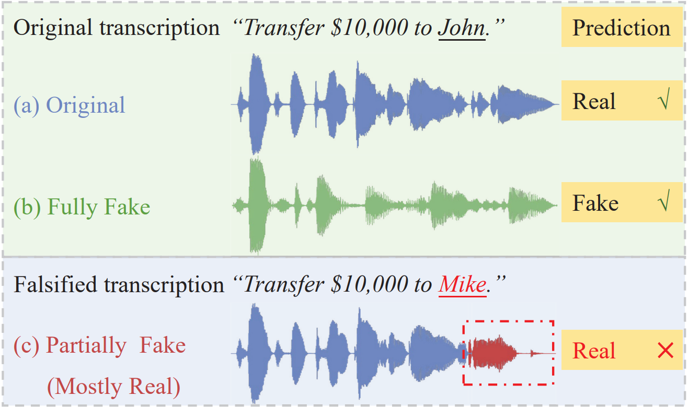
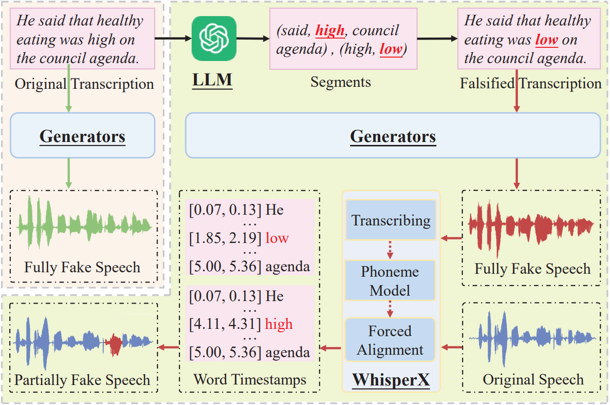

# SynSpeech

This is the official repository of the SynSpeech dataset.

## Abstract

The remarkable capability of generative methods to synthesize public-domain speeches that are difficult to differentiate from natural ones has raised concerns about the proliferation of disinformation. To this end, we contribute a fake speech detection dataset, denoted as the SynSpeech dataset, which includes fully fake and partially fake speeches in multiple domains covering both GANs-based and diffusion-based generative methods, serving as a prerequisite to support fake speech detectors. For the partially fake speeches, we utilize a large language model to replace interest segments like individual names, locations, adjectives, and verbs. Additionally, these segments will be substituted with fabricated clips synthesized by generative methods to create sentences with completely opposite meanings as partially fake speech. More specifically, a total of 164,924 fully fake speeches from six distinct generators, 44,070 real speeches from 108 individuals, and 99,496 partially fake speeches have been annotated as three kinds of labels, i.e., fully fake, real, and partially fake, respectively. In the experiments, we investigate quite a few fake speech detection models and customize them for two fake speech detection tasks for comparisons.

## Construction process

## Usage

1. **Download Dataset**: The dataset used in this paper can be accessed via the following [link](https://pan.baidu.com/s/1eEjwG7NK-7wkzG9HJXhMng?pwd=1234 ).
2. Run the `./scripts/data_generate.ipynb`.
3. Follow the instructions within the notebook to fetch the speech metadata.

Please note that you will need to enter the extraction code (1234) to download the dataset.

## Contributing

If you have any suggestions or find any issues, feel free to create an issue or submit a pull request.

## License

This project is licensed under the MIT License.

## Acknowledgments

Thank you for your interest in our work. We hope you find this code and dataset useful for your research or projects.
